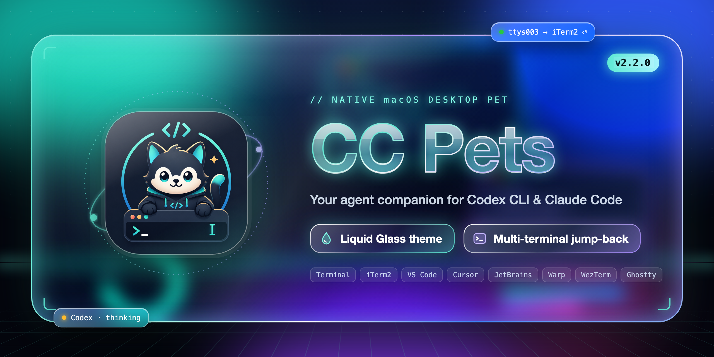
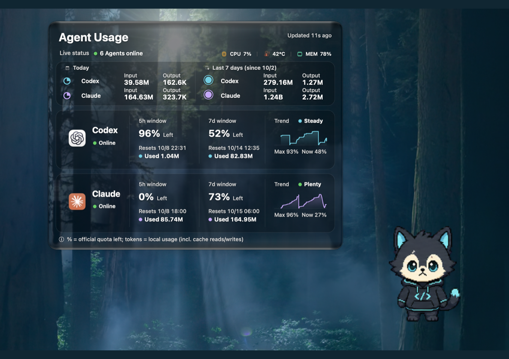
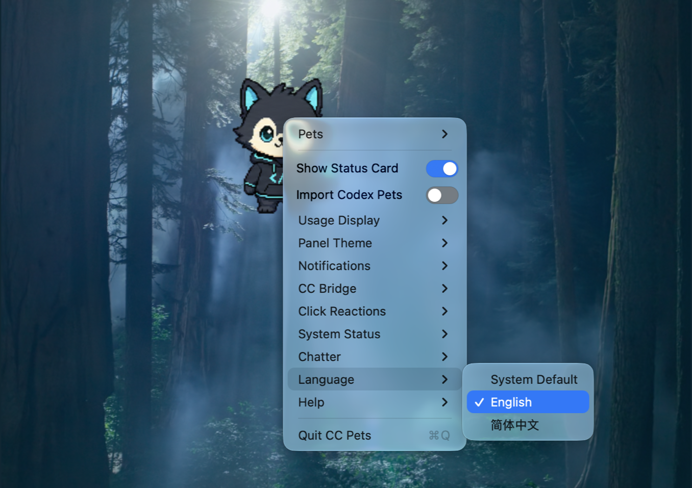

<p align="center">
  
</p>

# CC Pets

English | [简体中文](./README.zh-CN.md)

A native macOS desktop pet for Codex CLI and Claude Code CLI that needs neither
desktop app. Launch CC Pets directly, or let it appear automatically when Codex CLI
or Claude Code CLI starts. It reads five-hour and weekly quota data from the official
Codex App Server interface and Claude Code's official status line input.

> The app and CLI are available in English and Simplified Chinese (see [Language](#language)).

## What's new in v2.2.0

- **First English release** — menus, quota panels, status cards, update dialogs, and CLI
  output now support English and Simplified Chinese. Choose **Language → English**,
  **简体中文**, or **System Default** in the right-click menu.
- **English panel polish** — stronger summary headings, clearer spacing, shorter window
  titles and risk messages, and a compact explanation of quota and token totals.
- **Language-specific release highlights** — update dialogs read only the matching
  `English` or `简体中文` section of GitHub Release notes. A missing section leaves the
  highlights empty; content from another language is not substituted.

See the [changelog](./CHANGELOG.md) for the full list.

## Screenshots

English — v2.2.0 quota panel and Language menu:

<p align="center">
  
  
</p>

## Features

- Supports English and Simplified Chinese in the app and CLI, with live UI language switching.
- Offers Classic and native Liquid Glass panel themes on macOS 26 and later.
- Starts with Codex CLI or Claude Code CLI and closes after the last managed CLI exits.
- Shares one pet across multiple simultaneous Codex and Claude sessions.
- Shows five-hour and weekly remaining quota, reset times, local token totals, and seven-day trends.
- Converts reset times to the Mac's current system time zone.
- Responds to thinking, tool, approval, subagent, completion, and failure events.
- Displays a redacted glass status card with the active CLI session count.
- Returns to the terminal that triggered an event when its hook status card is clicked, including sessions started without the wrapper scripts.
- Lists up to eight recent online Agent terminal sessions from the status card icon.
- Badges the status icon with the number of sessions waiting for approval and pins those sessions to the top of the list.
- Speaks up when an Agent sits in approval or thinking longer than its threshold.
- Announces new versions through the pet with release highlights and updates from the right-click menu.
- Supports optional local quota history and macOS notifications.
- Supports third-party CLI agents through a provider event protocol.
- Includes editable global and per-pet speech.
- Offers **Chatter → Line Source → Pet-specific Lines / Default Lines**. Pet-specific lines
  override shared sections; default lines use only the editable shared speech file. The
  selection persists across pet changes and restarts, with pet-specific lines selected initially.
- Includes one original pet and can download compatible assets from PetDex.
- Uses native AppKit with no Electron runtime.

## Requirements

- macOS 13 or later
- Node.js 18 or later
- Codex CLI and/or Claude Code CLI installed and signed in
- zsh
- Xcode Command Line Tools (`xcode-select --install`)

## Installation

### Install from npm

```bash
npm install -g cc-pets@latest --allow-scripts=cc-pets
# Open a new terminal after the first installation.
codex
# or
claude
```

The `--allow-scripts=cc-pets` option allows recent npm versions to run the
package's `postinstall`. That step builds the native app, installs both hook
integrations, configures shell shims, and installs `~/Applications/CC Pets.app`.
If npm installed the package without running its scripts, initialize it manually:

```bash
cc-pets install
```

To persist the npm install-script allowlist for future installations:

```bash
npm config set allow-scripts=cc-pets --location=user
```

The allowlist only affects future installs, so reinstall the package or run
`cc-pets install` after changing it.

When launched through `codex-with-pet` or `claude-with-pet`, CC Pets captures the
terminal identity before the agent starts, which is the most precise source. A
session started directly — plain `codex` / `claude`, or a terminal window opened
before the shims were installed — falls back to the kernel: the controlling
terminal and the host terminal application are resolved from the process tree, so
its status cards are clickable as well. Such a session writes no pid file, so it
stays in the recent-session list while its hooks keep emitting events and leaves
the list after 60 idle seconds.

Every hook status card is clickable. The circular status icon lists up to eight
recent online Agent terminal sessions. Terminal.app and iTerm2 are selected
precisely by TTY. Without an editor extension, VS Code, JetBrains IDEs, Warp,
WezTerm, and Ghostty fall back to activating the owning application; selection of
an internal tab is left to that application. macOS may request Automation
permission on the first Terminal.app or iTerm2 jump.

### Install from source

```bash
git clone https://github.com/Sunnyshinnny776/cc-pets.git
cd cc-pets
npm install -g . --ignore-scripts
cc-pets install
# Open a new terminal after the first installation.
codex
# or
claude
```

CC Pets installs `cc-pets`, `codex-with-pet`, and `claude-with-pet`. It creates
`codex` and `claude` shims under `~/.cc-pets/shims` and adds one marked block to
`~/.zshrc`; the real CLI binaries are not replaced. The shims also handle casing
variants on the default case-insensitive macOS filesystem.

If a real CLI is not on the current `PATH`, set its absolute path:

```bash
export CODEX_REAL_BIN=/absolute/path/to/codex
export CLAUDE_REAL_BIN=/absolute/path/to/claude
```

The wrappers pass the current terminal environment through unchanged. They do not
load or execute `.env` files.

## Commands

```bash
cc-pets build                 # Build the native app.
cc-pets                       # Start independently from a CLI session.
cc-pets --foreground          # Run in the foreground for debugging.
cc-pets --version             # Print the installed version.
cc-pets --status              # Print parsed Codex quota data.
cc-pets --history             # Print local quota history as JSON.
cc-pets clean                 # Remove rebuildable state and caches.
cc-pets doctor                # Check the installation and integrations, with fixes.
cc-pets paths                 # List where settings, caches and data are stored.

cc-pets pet search otter      # Search the configured asset source.
cc-pets pet add boba          # Install an asset into CC Pets' own directory.
cc-pets pet list              # List installed assets.
cc-pets pet remove boba       # Remove an installed asset.

cc-pets --help                # List all commands.
cc-pets install               # Repair or reinitialize integrations.
cc-pets bridge enable            # CC Bridge (experimental, off by default); see CC_BRIDGE.md.
cc-pets bridge status            # Show CC Bridge state and online sessions.
cc-pets bridge disable           # Remove CC Bridge integrations.
cc-pets uninstall             # Remove integrations and restore the status line.
cc-pets uninstall --purge     # Also remove the app, app data and preferences after confirmation; keeps assets and phrases in ~/.cc-pets.
cc-pets uninstall-app         # Remove only ~/Applications/CC Pets.app.

codex-with-pet                # Start the pet and enter Codex CLI.
claude-with-pet               # Start the pet and enter Claude Code CLI.
```

`package.json` is the single version source. Use `npm version patch`, `minor`, or
`major` for a future release; npm runs the test suite and the build writes the
version into the generated app's `Info.plist`.

## Agent integration

Codex Hooks and Claude Code Hooks drive the pet's agent-state animations. After a
first installation or a Codex Hook update, start Codex and run `/hooks` to review
and trust the CC Pets Hook. Codex skips untrusted user hooks.

The Claude Code integration merges into `~/.claude/settings.json` while preserving
existing `env`, `model`, `statusLine`, and hook settings. Its quota collector is
injected into the existing status line script without changing the configured
script path or output.

Third-party CLI agents can send redacted state events through standard input:

```bash
printf '%s' '{"schemaVersion":1,"provider":"MyAgent","state":"thinking"}' \
  | cc-pets provider-event
```

See [Provider protocol](./PROVIDER_PROTOCOL.md). The protocol does not accept
prompts, command text, file contents, or model output.

## Pet interaction

| Interaction | Response |
| --- | --- |
| Hover over the head | Head interaction animation |
| Hover over the pocket | Pocket animation and quota panel |
| Hover over the feet | Foot interaction animation |
| Hover on either body side | Directional interaction animation |
| Click | Playful response animation |
| Drag left or right | Directional drag animation |
| Right-click | Pet, notification, Help (update check and About), and exit menu |

The **Panel theme** submenu offers **Classic** and **Liquid Glass**. Classic is the
default. Changes apply immediately to the quota panel, status card, and speech
bubble, and persist across restarts. Liquid Glass uses native system glass and is
available on macOS 26 and later only. Building native glass support requires the
macOS 26 SDK or later. The same submenu has a **Glass dimming** setting for the quota
panel, status card, and speech bubble: Clear (0%), Light (15%), Standard (25%,
default), or Legible (45%). Lower levels
look more transparent; higher levels keep text readable over light backgrounds.

### Language

The **Language** submenu offers **System Default** plus every bundled language,
currently **English** and **简体中文**. System Default follows the first supported
entry in macOS's preferred languages and falls back to English. Menus and panels switch right away; system
buttons in dialogs follow after the next launch. The choice is written to
`~/.cc-pets/language`, so `cc-pets` commands, hooks, and CC Bridge messages use the
same language; set `CC_PETS_LANGUAGE=en` or `zh-Hans` to override it for one
command. If you never edited `~/.cc-pets/speech.txt`, it switches to the default
lines of the new language; edited lines are left alone. To contribute another
language, see [Adding a language](./CONTRIBUTING.md#adding-a-language).

The pet switcher scans only built-in assets and `~/.cc-pets/pets/`. It does not
scan `~/.petdex/pets/` or `~/.codex/pets/`. To use assets installed by Codex,
enable **Import Codex pets** in the app's right-click menu; CC Pets copies valid
assets into its own directory without overwriting names already present.

External assets use their directory name in the menu. The app caches the list and
rescans when the modification time of `~/.cc-pets/pets/` changes, so CLI add/remove
operations do not require a restart or rebuild.

CC Pets supports the Codex `spriteVersionNumber` layouts:

- v1 or a missing version: `1536×1872`, an `8×9` grid
- v2: `1536×2288`, an `8×11` grid
- cell size: `192×208`

The first nine rows contain idle, right drag, left drag, right-side interaction,
head, pocket, feet, click, and left-side interaction animations. The two v2 rows
add 16-direction mouse tracking while idle.

## Quota and local usage data

Codex quota data comes from the official Codex App Server interface. CC Pets starts
the installed Codex CLI as `codex app-server --stdio`, reads the current windows with
`account/rateLimits/read`, and follows `account/rateLimits/updated` notifications. The
server-side values replace the rate-limit snapshots recorded in local `token_count`
events under `~/.codex/sessions`; a local snapshot is used only when it is newer than
the last server value. A `window_minutes` value of `300` is the five-hour window and
`10080` is the weekly window. CC Pets displays remaining percentage and does not
substitute expired history when a current window is unavailable.

Claude quota data comes from `rate_limits.five_hour` and
`rate_limits.seven_day` in Claude Code's official status line input. These values
are available for Claude.ai Pro/Max subscriptions after the session's first API
response. Missing values display as `--`.

Local token counts are usage observations, not subscription quota. Codex counts
come from local session events. Claude counts come from assistant usage records
under `~/.claude/projects`, aligned to the server reset window and deduplicated
across resume, fork, and compaction copies.

The persistent app reads `~/.codex` and `~/.claude` by default instead of inheriting
session-specific `CODEX_HOME` or `CLAUDE_CONFIG_DIR` values. Advanced users can
override these with `CC_PETS_CODEX_HOME` and `CC_PETS_CLAUDE_CONFIG_DIR`.

Local seven-day quota history is disabled by default. When enabled, it is stored
only at `~/Library/Application Support/CC Pets/quota-history.json`, retains seven
days, and records at most once every 15 minutes.

## Speech

The pet's speech comes from `~/.cc-pets/speech.txt`. Open **Speech → Edit lines…**
in the right-click menu to edit, validate, preview, or restore it. Lines are grouped
under stable situation tags such as `[idle]`, `[done]`, and `[state_thinking]`.
Each line is limited to 30 characters if it contains Chinese, Japanese, or Korean
text, and to 40 characters otherwise.

Supported live placeholders are `{quota5h}`, `{resetTime}`, `{toolName}`,
`{sessionMin}`, `{failCount}`, and `{hour}`. A line is skipped if one of its values
is unavailable.

Per-pet overrides live at `~/.cc-pets/speech/<pet-name>.txt` (the built-in asset
uses `builtin-默认.txt`). A missing section falls back to global speech; a present
section replaces that global section; an empty present section keeps the pet silent
for that situation.

The four speech-frequency presets coordinate an hourly budget, cooldown, idle
threshold, and probability. Speech stays silent while an agent is actively working.
Advanced debugging values use the existing app preferences domain:

```bash
defaults write com.universewang.cc-pets CCPetsSpeechFrequency -string chatty
defaults write com.universewang.cc-pets CCPetsSpeechCooldown -float 0
defaults write com.universewang.cc-pets CCPetsSpeechHourlyBudget -int 100
defaults write com.universewang.cc-pets CCPetsBoredomScale -float 0.1
defaults write com.universewang.cc-pets CCPetsSpeechDebugTag -string quota_low
defaults delete com.universewang.cc-pets CCPetsSpeechCooldown
```

`com.universewang.cc-pets` is the existing technical bundle/preferences identifier.

## Pet assets

This project does not operate an asset registry. The repository and npm package
contain one original built-in asset, ByteMochi (`默认.webp`), distributed under the
MIT License. All other assets are downloaded by the user to
`~/.cc-pets/pets/<name>/` and are not part of this repository or npm package.

The `cc-pets pet` command consumes PetDex's public manifest at
`https://petdex.dev/api/manifest` and accepts downloads only from allowlisted
`assets.petdex.dev` URLs. CC Pets downloads and renders those files locally; their
licenses, copyrights, and terms remain with their respective authors and platforms.

```bash
cc-pets pet search otter
cc-pets pet add boba doraemon
cc-pets pet add petdex:boba --as boba-petdex
cc-pets pet list
cc-pets pet remove boba
cc-pets pet source
cc-pets pet dir
```

The source and installation record is stored separately in `.source.json`; upstream
`pet.json` remains unchanged. A conflicting local name is never overwritten. The
`--as` option accepts localized names but rejects path separators, whitespace, and
consecutive `..` sequences.

### Importing Codex assets

CC Pets never renders directly from `~/.codex/pets/`. Enable **Import Codex pets**
to copy assets containing `spritesheet.webp` or `spritesheet.png` into
`~/.cc-pets/pets/`. Existing names are skipped, imports are idempotent, and disabling
the option does not delete previously copied files.

PetDex's own CLI installs to `~/.petdex/pets/`, which CC Pets does not scan. Use
`cc-pets pet add` when you want an asset installed into CC Pets' own directory.

Set `CC_PETS_PETS_DIR` to use another asset directory. Apps started through `open`
do not inherit shell variables; use `cc-pets --foreground` or `launchctl setenv` if
the native app also needs the override.

See [Third-party notices](./THIRD_PARTY_NOTICES.md) before using or redistributing
external assets.

## Privacy

- Codex quota is read through the official Codex App Server started from your installed Codex CLI with its existing sign-in; Claude quota comes from the status line input Claude Code passes locally. Token counts are read from local Codex and Claude Code files.
- Hooks write only redacted state events and quota cache files to the current user's temporary directory.
- Local quota history is disabled by default and retains seven days when enabled.
- Status cards and notifications show only provider, state, and redacted tool category.
- CC Pets contains no telemetry and uploads no conversations, quotas, credentials, or usage statistics.
- On launch, and when a CLI reopens the running pet, CC Pets asks the npm registry for the latest version (at most once every 10 minutes per run); only when a newer version exists does it read that version's release notes from the GitHub API. These requests carry no account or usage data.
- Exiting the pet or running `cc-pets uninstall` leaves no background daemon running.
- [CC Bridge](./CC_BRIDGE.md) is off by default. When enabled, messages between sessions are stored
  in the current user's temporary directory (owner-only, 24-hour expiry); it is the only feature
  that stores message content.

## Uninstall

Remove integrations while the npm package is still installed:

```bash
cc-pets uninstall
cc-pets uninstall-app
source ~/.zshrc
npm uninstall -g cc-pets
```

The uninstaller removes only CC Pets-marked hooks, shell configuration, and shims,
and restores the previous Claude status line. Other user settings and hooks remain.

## Project status and trademarks

CC Pets is a community open-source project with no affiliation, authorization, or
official partnership with OpenAI, Anthropic, PetDex, or any character rights holder.
Codex, ChatGPT, Claude, their icons, and their trademarks belong to their respective
owners.

## License

The code and the original ByteMochi built-in asset use the [MIT License](./LICENSE).
External assets do not automatically receive this project's license. See
[Third-party notices](./THIRD_PARTY_NOTICES.md).
